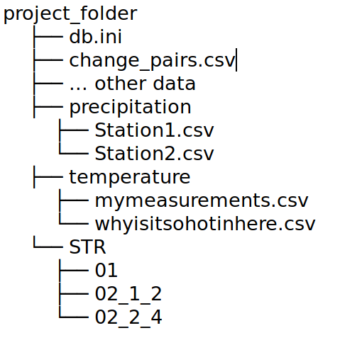

# ms-stretch Examples

This is an extra repository that contains some additional information
for the MSNoise plugin ['ms-stretch'](https://github.com/janfer95/ms-stretch).
It includes a few example plots, the needed folder structure for some
of the ms-stretch commands to work and example files to double check if
something might not be working. 

## Example Plots

In the ``Example_plots`` folder you can find plots made with the
plugin to give some ideas of what exactly can be done with it.

I tried to include plots that showcase the different options of
the commands, but usually a mixture between the arguments is also
possible. The ``--help`` argument in the command prompt is a useful
tool to find out what exactly can be configured.

## Example Files

This folder contains an example precipitation and ``change_pairs.csv`` file.
In general, for the forcings the file should have three columns:
``Date``, ``Data``, ``Error`` (with exactly that header, no spaces).

The ``change_pairs.csv`` is optional and is used to "nicen up" the visualization
of the pairs to be plotted. If in a project the pair is called 
``5K_GSW01_5K_GSW01`` then by default the plot would show ``5K.GSW01_5K.GSW01``. 
This can be a bit lengthy at times, so if the argument ``-C True`` is 
passed the script checks the ``change_pairs.csv`` file and replaces for each
row the first value with the one after. With the given file, for example we'd get
``G1_G1``, which can make the plot less cluttered. 

## Folder Structure

An example of a typical folder structure to be used is shown in this figure. 
Notice the usage of the same filters with different lag time windows and 
the location of the ``change_pairs.csv`` file. 

 

## Questions

For questions look at the [plugin repository](https://github.com/janfer95/ms-stretch)
documentation or even in the source code documentation. Questions or bugs can also 
be send to me by e-mail: jfkuehn@gfz-potsdam.de
